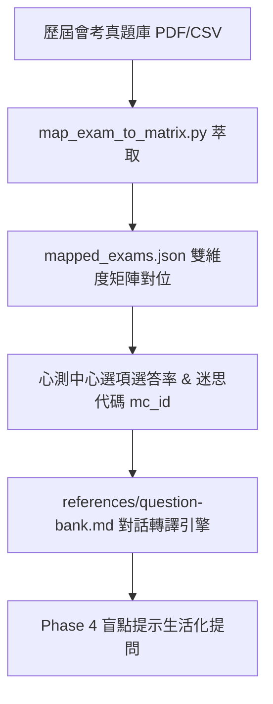

# 🛡️ RDQ 水循環學習戰隊 ｜ 學生專屬實戰操作手冊 & FAQ 終極指南 (全功能完備版)

> **給親愛的同學與家長**：
> 歡迎來到 **RDQ 學習防禦基地**！這裡不是考試，也沒有討厭的打分與排名。
> 我們唯一的任務，就是陪你在最小的壓力下，像打遊戲刷怪一樣，把不小心漏掉的知識弱點「防禦」起來！

---

## 📖 目錄
1. 🎯 **第一部分：黃金對話指令公式 (如何精確觸發)**
2. 📄 **第二部分：【極致精確模式】上傳課本/講義檔**
3. 🔄 **第三部分：RDQ 課後複習模式：8 大階段全流程詳細解密 (含課本對照與 3 大優勢)**
4. 🎯 **第四部分：Phase 4 盲點提示 — 會考歷屆陷阱真題轉譯機制**
5. 🌐 **第五部分：Web 儀表板實體阻力與閃卡操作 (localhost:8000)**
6. 📸 **第六部分：考卷錯題上傳與匯入教學 (2 大方法)**
7. 🎬 **第七部分：真實情境實戰演練 (國二理化案例)**
8. ❓ **第八部分：家長與學生必讀 12 大 FAQ**

---

## 🎯 第一部分：黃金對話指令公式 (如何精確觸發)

為了讓 AI 小幫手能 100% 精準對位學校的考點，建議使用以下**黃金指令公式**：

### 🔑 黃金指令公式：
> **「年級/學期 ＋ 科目/版本 ＋ 單元/課次名稱 ＋ 複習指示」**

| 複習類型 | 建議對話指令 (複製即可用) | AI 運作說明 |
|---|---|---|
| **精確單元** | *「幫我複習國二上理化第一課 進入理化實驗室」* | 🎯 **精準對位** 108 課綱理化實驗安全考點。 |
| **特定版本** | *「幫我複習翰林國一上國文第一課 聲音鐘」* | 📚 鎖定特定版本課文重點與注音國字。 |
| **模糊啟動** | *「幫我複習今日自然」* | 🤖 AI 會主動追問：「請問是國二理化第幾課呢？」協助你鎖定範圍。 |
| **既有錯題** | *「我要做今日防禦任務」* | 🛡️ 自動呼叫 Leitner Box 到期的舊錯題。 |

---

## 📄 第二部分：【極致精確模式】上傳課本/講義檔

如果你希望複習範圍 **100% 嚴格鎖定在學校老師教的那幾頁**，請使用「極致精確模式」！

### 📥 操作方式：
1. **複製貼上**：直接將課本段落、講義重點複製貼在聊天對話框。
2. **檔案/照片上傳**：點選對話框的夾帶檔案，上傳課本 PDF、照片或 Markdown 檔。
3. **搭配口訣**：
   > *「這是我今天的課文內容（貼上文字/上傳檔案），請嚴格根據這份內容幫我進行蘇格拉底複習。」*

### 🛡️ 課本上傳後的「三條紅線保護」：
- **100% 絕不超綱**：AI 只會問上傳文本裡出現的概念，絕對不問高中或課外內容。
- **降級選項出自課本**：就算答不出來，A / B / C 選項也全出自課本原句。
- **精準標註出處**：解答會附上 *「根據您提供的課本第 2 段…」*。

---

## 🔄 第三部分：RDQ 課後複習模式：8 大階段全流程詳細解密

把課本/講義上傳後，RDQ 的核心靈魂（**蘇格拉底引導、三層鷹架降級、迷思澄清、Leitner 遺忘曲線**）**一個步驟都不會少**！

唯一的差別是：**AI 提問與選項的「知識邊界」，會 100% 嚴格鎖定在您上傳的這份課本文章中**！

### 🧬 RDQ 8 大階段全流程圖：
```mermaid
graph TD
    P0[Phase 0: 範圍與課文邊界鎖定] --> P1[Phase 1: 象限Ⅰ 蘇氏開局·引導回憶]
    P1 --> P2[Phase 2: 象限Ⅱ 三層鷹架 L1➔L2 降級選項]
    P2 --> P25[Phase 2.5: 迷思澄清 ⚠️ 與微驗證]
    P25 --> P3[Phase 3: 象限Ⅲ 知識挖掘 🔴黃綠燈]
    P3 --> P4[Phase 4: 象限Ⅳ 盲點提示 (最後一題)]
    P4 --> P56[Phase 5&6: 產出覆盤卡與 Web 引流]
    P56 --> P78[Phase 7&8: API 自動入庫與 EDS 移交]
```

---

### 🔍 「有上傳課本」 vs 「無上傳課本」 8 大階段對照表

| RDQ 階段 (Phase) | 核心執行動作 | 沒上傳課本時 (通用模式) | 📥 **上傳課本後 (極致精確模式)** |
|---|---|---|---|
| **Phase 0<br>範圍鎖定** | 靜默判定科目、單元與 108 課綱點位。 | 依據全台灣 108 課綱通用庫提問。 | 🎯 **100% 鎖定在上傳的課本文本**，絕不出文字以外的概念。 |
| **Phase 1<br>【象限Ⅰ】引導回憶** | **蘇氏開局**：不教書、不條列，用開放式問題讓孩子自己想。 | 「關於光合作用，你第一個想到的關鍵字是什麼？」 | *「根據你上傳的這段課文，作者第一個提到的化學反應是什麼？」* |
| **Phase 2<br>【象限Ⅱ】鷹架降級** | **L1 想想看 ➔ L2 選一個**：孩子答不出（說不知道）時，**絕不硬撐**，立刻給 A/B/C 三選一。 | 選項由 AI 根據課綱邏輯生成通用選項。 | 📚 **A/B/C 三個選項的文意，100% 摘自您上傳的課文段落**！ |
| **Phase 2.5<br>迷思澄清 (⚠️)** | 孩子給出自信但錯誤的回答時，用「很多人也這樣想」溫和澄清，並做**微型驗證**。 | 比對通用題庫常犯迷思。 | 比對課文中學生最容易看錯或搞混的句型細節。 |
| **Phase 3<br>【象限Ⅲ】知識挖掘** | 依 **🔴紅燈（基礎）、🟡黃燈（細節）、🟢綠燈（次要）** 控制提問量（Lite 模式只問 1~3 題）。 | 挖掘課綱中的核心概念。 | 🔴 必問課文關鍵主旨；🟡 僅詢問課文次要細節，不給認知負擔。 |
| **Phase 4<br>【象限Ⅳ】盲點提示** | **最後一題強制啟動**：出一個提示問題引導孩子發現沒想過的關聯。 | 「你有想過如果沒有葉綠素會怎樣嗎？」 | *「你有想過課文第二段提到的這個設計，跟第三段有什麼關係嗎？」* |
| **Phase 5 & 6<br>產出與確認** | 生成一頁視覺化覆盤卡（包含 `✅已掌握`、`❓待確認`、`⚠️迷思`），並引導至 Web。 | 生成通用學習覆盤卡。 | 覆盤卡**精準標註課文出處**（例如：*「詳見上傳課文第 2 段」*）。 |
| **Phase 7 & 8<br>入庫與 EDS** | 經由 API 寫入 `review_index.db`，計算 Leitner Box 記憶曲線；弱點多時移交 EDS。 | 自動入庫並記錄 Leitner 週期。 | 自動入庫，且生成的 Web 閃卡會附帶您上傳的課文關鍵句！ |

---

### 🌟 課本上傳後的 3 大終極優勢

1. **零超綱保障**：孩子不會因為被問到學校沒教、課本沒寫的題目而感到挫折。
2. **精準抓出「看過以為懂」**：很多孩子課本順著讀過去以為懂了，AI 針對這篇文章進行「蘇格拉底反問」，立刻能幫孩子發現哪一段其實沒看懂。
3. **完全契合學校考試**：段考與平時考大部分題目都是從課文/講義延伸出來的，針對課文做 RDQ 複習，投資報酬率最高！

---

## 🎯 第四部分：Phase 4 盲點提示 — 會考歷屆陷阱真題轉譯機制

Phase 4【象限Ⅳ】盲點提示的靈魂，正是將「歷屆會考高誘答率陷阱題 & 難題」轉譯為「蘇格拉底對話問句」！



### 1. 底層數據大數據對位：
- **`mapped_exams.json` (3.3 MB)**：收錄歷屆會考真題，將每題對位至 **108 課綱雙維度知識矩陣 (X 軸內容 × Y 軸認知表現)**。
- **`mc_id` 迷思代碼**：解析心測中心選答率統計，標記出答錯率最高的誘答陷阱。

### 2. 會考硬題目轉譯範例：
- **傳統會考題目 (硬考題)**：*「下列關於光合作用暗反應的敘述，何者正確？ (A) 光反應不需要光照 (B) 暗反應在黑夜中才能進行 (C) 暗反應需要光反應產生的能量 (D)...」*
- ➔ **RDQ Phase 4 轉譯後的對話問句 (活思考)**：
  > 🤖 **AI**：*「你有想過，如果在完全沒有光的黑夜裡給植物足夠的二氧化碳，暗反應還能繼續運作嗎？你覺得它最需要什麼？」*
  > 👦 **孩子**：*「黑夜應該可以吧？它叫暗反應啊！」*
  > 🤖 **AI (迷思探測 ⚠️)**：*「很多人看到『暗』字也會這樣覺得喔！不過暗反應其實需要『光反應在白天存下來的能量包 (ATP)』。如果能量包用完了，黑夜裡它也動不了喔！」*

### 3. 變體排除與防重複 (`mc_probe_variant`)：
選題時會自動查詢 `review_index.db`，**排除上次使用過的迷思探測變體**，確保孩子不會吃到重複死記的題目！

---

## 🌐 第五部分：Web 儀表板實體阻力與閃卡操作 (http://localhost:8000)

每天放學或空檔，打開瀏覽器連結：👉 **[http://localhost:8000](http://localhost:8000)**

### 📱 介面三大分區解密：
```
+-----------------------------------------------------------------------+
|  [RDQ Ecosystem]  今日學習防禦任務                     [ ➕ 快速匯入錯題 ] |
|  [ 3 待防禦項目 ]  [ 0 已成功晉級 ]  [ Box 2 當前平均區間 ]                 |
+-----------------------------------------------------------------------+
| 🎴 閃卡特訓清單                                                       |
|  [自然] [Leitner Box 2] 光合作用                                      |
|  Q: 光合作用中的暗反應主要利用何種物質合成葡萄糖？                           |
|  +-----------------------------------------------------------------+  |
|  | ✍️ 實體阻力解題區：在此輸入你的推導或關鍵字...                       |  |
|  +-----------------------------------------------------------------+  |
|  [ 驗證答案 (解鎖翻牌) ] -> (翻牌後顯示解析與 [答對晉級 ➔] [卡關降級 ↩])       |
+-----------------------------------------------------------------------+
```

---

## 📸 第六部分：考卷錯題上傳與匯入教學 (2 大方法)

### 方法 A：對話框拍照上傳 (最推薦)
1. 用手機拍下考卷或小考錯題。
2. 上傳至對話框並說明：*「把這張考卷照片加入錯題本」*。
3. AI 自動辨識題目與解析，並寫入資料庫！

### 方法 B：Web 儀表板按鈕匯入
1. 進入 [http://localhost:8000](http://localhost:8000)。
2. 點擊右上角 **`➕ 快速匯入錯題`**。
3. 填入科目與題目文字，點擊「確定匯入」即可生成防禦閃卡！

---

## 🎬 第七部分：真實情境實戰演練 (國二理化案例)

### 💬 步驟 1：放學回家，啟動對話
- **學生**：*「幫我複習國二上理化第一課：進入理化實驗室」*
- **AI (L1 想想看)**：*「沒問題！第一個問題：在實驗室稀釋濃硫酸時，應該是把濃硫酸倒入水中，還是把水倒入濃硫酸中？為什麼呢？」*
- **學生**：*「不太確定耶，好像是把水倒進去？」*
- **AI (L2 選項接住)**：*「沒關係！我們看這兩個選項：<br>A) 將濃硫酸沿玻璃棒慢慢注入水中，並不斷攪拌。<br>B) 將水快速倒入濃硫酸中。<br>你覺得哪一個才是安全的？」*
- **學生**：*「選 A！」*
- **AI (溫和澄清)**：*「太棒了！答對了！因為濃硫酸稀釋會放出大量熱量，如果把水倒進濃硫酸會沸騰噴濺很危險喔！我已經幫你把這個安全考點記在防禦庫中了！」*

---

## ❓ 第八部分：家長與學生必讀 12 大 FAQ

### Q1：課本上傳後也會符合 RDQ 複習模式嗎？
**答：100% 完全符合，而且精準度更高！** 蘇格拉底反問、L1/L2 鷹架降級、迷思澄清與 Leitner 記憶曲線完全照常運作，差別僅在於知識邊界被 100% 鎖定在您上傳的這份課文中。

### Q2：Phase 4 盲點提示的問題是怎麼來的？會不會隨便出題？
**答：來自歷屆會考大數據與心測中心高誘答率題庫！** 系統解析了 `mapped_exams.json`，將會考最高頻、最容易掉坑的陷阱題轉譯為生活化對話問句，並具備 `mc_probe_variant` 變體排除機制，確保絕不重複死板出題。

### Q3：如果孩子說得太簡短，系統會不會亂問超綱題目？
**答：絕對不會！** 系統有防呆機制。如果孩子只說「幫我複習」，系統會先追問年級與單元；若提供了課本檔案，系統更會 100% 鎖定在該文本範圍內。

### Q4：如果孩子以為自己懂了，但觀念是錯的，系統會發現嗎？
**答：會的！** 這正是「蘇格拉底反問」的威力。當孩子自信給出錯誤答案時，AI 會以非評判語氣引導：「很多人也這樣想喔！不過其實…」，並用簡單的微型驗證確定孩子真正釐清觀念。

### Q5：實體阻力 (Physical Friction) 一定要在 Web 端打字嗎？
**答：是的！** 直接翻牌看答案只會產生「流暢性幻覺」（看過以為會了）。在解鎖前打出 3~5 個關鍵字，是大腦神經元活化並形成長期記憶的關鍵。

### Q6：孩子作業很多，每天要花多久時間複習？
**答：只需 3 ~ 5 分鐘！** RDQ 採用 Lite 輕量模式。每次對話僅 1~3 題，或 Web 端清完 2~3 張到期閃卡即可，絕不增加負擔。

### Q7：複習過的錯題，多久會再出現一次？
**答：由艾賓浩斯 Leitner Box 記憶演算法自動精算！**
- 答對一次 ➔ 升級至 Box 2（3 天後再出現）。
- 再次答對 ➔ 升級至 Box 3（7 天後再出現）。
- 答錯卡關 ➔ 降級保護（隔天再次練習）。

### Q8：錯題本需要家長手動幫忙整理嗎？
**答：完全不需要！** 對話過程或上傳照片後，AI 會自動將題目、解答、失分原因 (`loss_reason`) 及 108 課綱代碼寫入 SQLite 資料庫 (`review_index.db`)。

### Q9：如果連不上 http://localhost:8000 怎麼辦？
**答：表示本地端的 Web 伺服器尚未開啟。**
可以在對話中告訴 AI：「幫我開啟 Web 儀表板伺服器」，AI 會立刻在背景啟動服務。

### Q10：系統如何知道什麼時候該交棒給考前特訓？
**答：當弱點累積到一定程度或大考前夕。**
系統偵測到學生即將段考或弱點累積時，會自動提示：「弱點圖譜已準備好，建議開啟 EDS (教育決策系統) 進行決勝特訓題型派發！」

### Q11：家長如何了解孩子的學習狀況與防禦進度？
**答：可以直接查看 Web 儀表板頂部的統計列。**
畫面會清楚顯示：`待防禦項目數`、`已成功晉級數` 以及 `當前平均 Leitner 記憶區間`。

### Q12：英文、國文等需要讀課文的科目要怎麼複習最有效？
**答：強烈建議使用「第二部分：上傳課本/講義檔」功能！**
將國文課文或英文文章貼給 AI，AI 會針對課文文意、注音國字、句型進行最精確的文本內問答。

---

## 🏆 給同學的戰鬥格言
> **「複習是發現你會了什麼，而不是考試。」**  
> 不怕做錯，只怕沒發現；天天防禦 3 分鐘，段考輕鬆拿高分！
